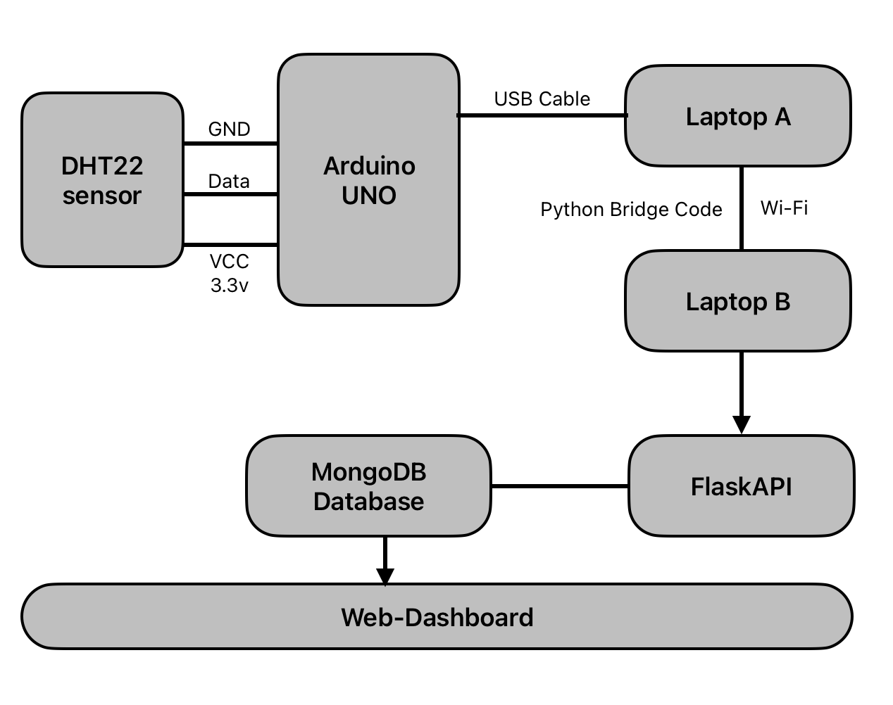

# IoT Temperature & Humidity with Web Dashboard

## Overview
This project collects temperature and humidity data using a DHT22 sensor connected to an Arduino. Data is sent via a Python bridge to a Flask backend, which validates and stores it in MongoDB. The project includes a modern dashboard frontend (React, CSS) for visualizing sensor data, is fully containerized, and includes automated testing and API documentation.

## Architecture



- **Arduino**: Reads DHT22 sensor and sends data over serial.
- **Python Bridge**: Reads serial data and POSTs to Flask API.
- **Flask Backend**: Validates, stores, and serves data via REST API.
- **MongoDB**: Stores sensor data.
- **React Frontend**: Visualizes temperature and humidity data in a dashboard UI.

## Dashboard Example


## Directory Structure
```
IOT-temp-sensor/
├── Arduino/           # Arduino code & Python bridge
├── backend/           # Flask backend, API, tests, Dockerfile
├── database/          # MongoDB init script
├── docker-compose.yml # Orchestrates backend & MongoDB
├── frontend/          # React dashboard
├── .gitignore         # Ignores venv, pycache, etc.
├── LICENSE            # MIT License
└── README.md          # Project documentation
```

## Quick Start

### 1. Arduino & Sensor
- Wire DHT22 to Arduino and upload `Arduino/Arduino.c`.

### 2. Python Bridge
- Install Python 3.
- Run:  
  ```bash
  python Arduino/Python-Bridge.py
  ```

### 3. Flask Backend (Local)
```bash
cd backend
python3 -m venv venv
source venv/bin/activate
pip install -r requirements.txt -r requirements-dev.txt
python app.py
```

### 4. Docker (Recommended)
```bash
docker-compose up --build
```
- Flask API: [http://localhost:8080](http://localhost:8080)
- MongoDB: `mongodb://localhost:27017`

### 5. Frontend Dashboard (React)
```bash
cd frontend
npm install
npm start
```
- Dashboard: [http://localhost:3000](http://localhost:3000)
- The dashboard uses CSS and provides:
  - A centered title and time range selection buttons (Past Hour, 1 Day, 7 Days, 30 Days)
  - Stats cards for each channel
  - Interactive temperature and humidity charts

## API Documentation
- Swagger UI: [http://localhost:8080/api/docs](http://localhost:8080/api/docs)

## Testing
- Backend:  
  ```bash
  PYTHONPATH=backend pytest backend/tests/
  ```
- Python Bridge:  
  ```bash
  python -m unittest Arduino/test_python_bridge.py
  ```

## Security & Validation
- Strict input validation and security headers in backend.
- Only essential files are tracked in git.

## Maintenance
- To update dependencies:  
  ```bash
  pip install --upgrade -r requirements.txt
  ```
- To clean:  
  ```bash
  find . -type d -name '__pycache__' -exec rm -rf {} +
  ```

## License
MIT License. See `LICENSE` for details.
